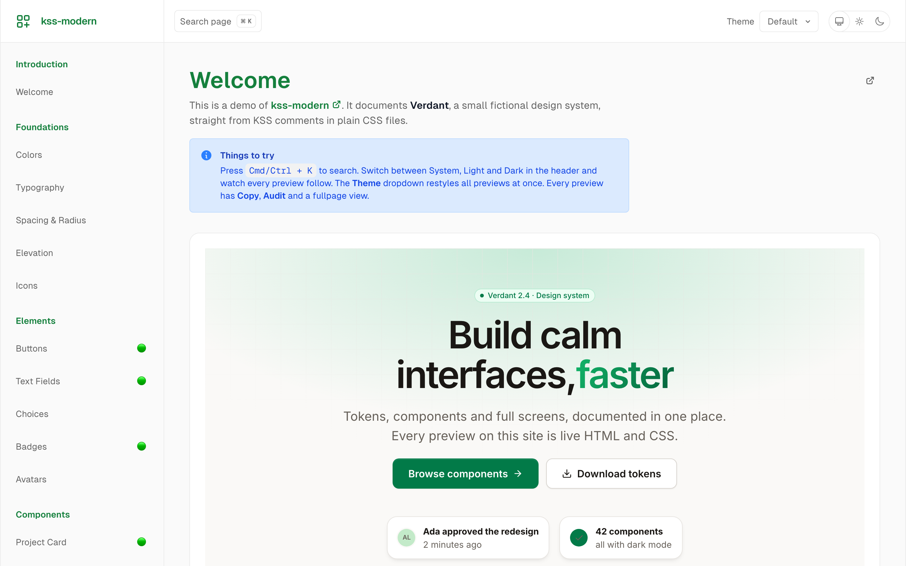
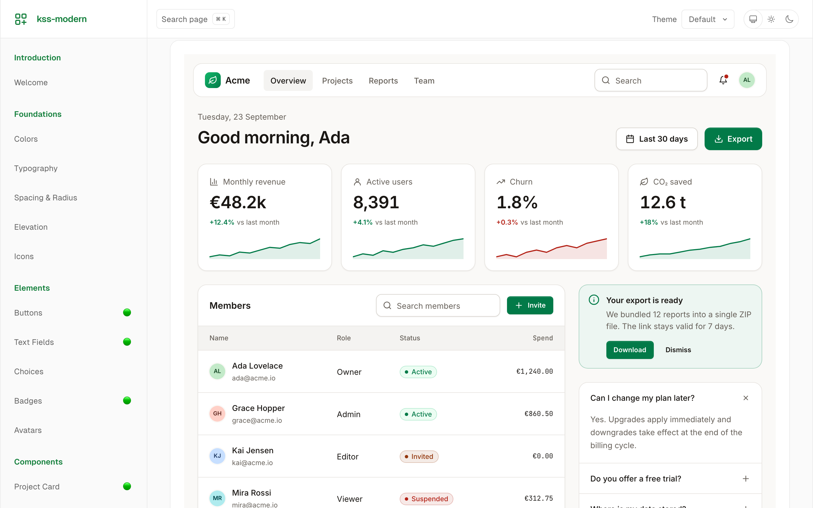
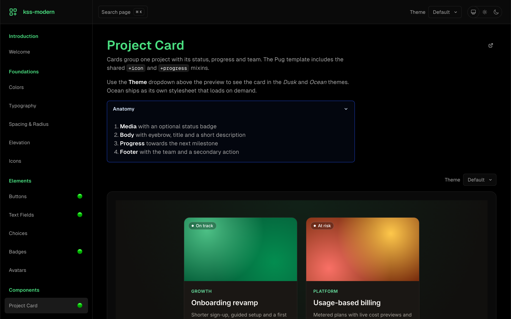
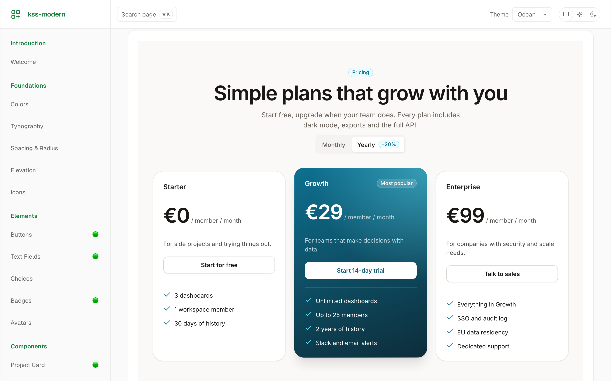
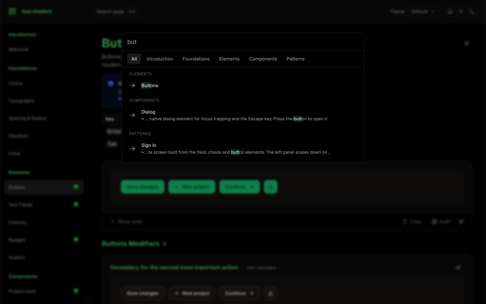

# kss-modern

A modern, KSS-compatible styleguide generator. Write KSS comments in your CSS or SCSS, and kss-modern turns them into a fast, accessible styleguide with live component previews, dark mode, themes and a built-in accessibility audit.

**[Open the live demo →](https://felixranesberger.github.io/kss-modern/)**

<picture>
  <source media="(prefers-color-scheme: dark)" srcset="docs/screenshots/welcome-dark.png">
  
</picture>

The demo documents Verdant, a small fictional design system. Its source in [`demo/content/`](demo/content/) is plain CSS, Pug and Markdown, so it doubles as a reference for writing your own styleguide.

<table>
  <tr>
    <td width="50%"></td>
    <td width="50%"></td>
  </tr>
  <tr>
    <td><b>Whole screens from reusable parts.</b> Pull other sections into a page with <code>&lt;insert-markup&gt;</code> and Pug <code>extends</code>.</td>
    <td><b>Dark mode everywhere.</b> Previews follow the System, Light and Dark toggle through <code>light-dark()</code> tokens.</td>
  </tr>
  <tr>
    <td></td>
    <td></td>
  </tr>
  <tr>
    <td><b>Preview themes.</b> Restyle every preview from the header, with an optional stylesheet per theme.</td>
    <td><b>Instant search.</b> <kbd>Cmd</kbd>/<kbd>Ctrl</kbd> + <kbd>K</kbd> searches titles and descriptions across the whole styleguide.</td>
  </tr>
</table>

## Features

- KSS-compatible comment parsing from CSS/SCSS files
- Live component previews with modifier variants
- Markup from inline HTML, static `.html` files or Pug templates (compiled in a worker thread pool)
- Reuse markup across sections with `<insert-markup>`
- Theme dropdowns in the header (`previewThemes` option) and per section (`Themes:`), optionally loading a stylesheet per theme
- Color palette and searchable icon gallery
- Markdown descriptions with alerts, accordions, tables and highlighted code
- Status badges, including automatic `Deprecated:` and `Experimental:` tags
- Figma embeds with light/dark sync
- Accessibility audit (axe-core) and HTML validation per component, or page-wide via `window.kssAudit()` for CI and AI agents
- Dark mode with a System/Light/Dark toggle
- Global search, keyboard navigation and "Open in Editor" links
- Watch mode that rebuilds only when KSS comments change

## Installation

```bash
npm install kss-modern
```

## Quick Start

```ts
import { buildStyleguide } from 'kss-modern'

await buildStyleguide({
  mode: 'production',
  outDir: './styleguide',
  contentDir: './src/sass/',
  projectTitle: 'My Design System',
  theme: '#005075',
  html: {
    lang: 'en',
    assets: {
      css: [{ src: '/css/styles.css' }],
      js: [],
    },
  },
})
```

This scans all `.css` and `.scss` files in `contentDir` for KSS comment blocks and generates a complete static styleguide in `outDir`.

## Documentation

- **[Setup Guide](docs/setup.md)** — Installation, configuration reference, watch mode, project structure, and API reference
- **[Usage Guide](docs/usage.md)** — Writing KSS comments, all available properties (markup, modifiers, colors, icons, Markdown, Figma, status, wrapper, html/body classes, themes, etc.), and styleguide UI features
- **[Changelog](CHANGELOG.md)** — Version history and release notes

## Basic KSS Example

```scss
/*
Button

A basic button component.

.btn--primary - Primary action button
.btn--outline - Outlined variant

Markup: <button class="btn {{modifier_class}}">Click me</button>

Styleguide 2.1
*/

.btn { /* styles */ }
```

## Markup Includes

The `Markup:` field accepts three formats. File paths are resolved relative to `contentDir`.

```scss
/* Inline HTML */
Markup: <button class="btn {{modifier_class}}">Click me</button>

/* Static .html file — contents are inlined as-is */
Markup: templates/components/badge.html

/* Static .pug file — compiled to HTML at build time */
Markup: templates/components/card.pug
```

## Development

```bash
bun install
bun run build          # Build: Vite (client assets) then Unbuild (Node.js library)
bun run dev            # Build + run dev server with Deno (watches test-styleguide/ content)
bun run demo           # Build the public demo into demo-dist/ (DEMO_BASE_PATH sets the served path)
bun run demo:screenshots # Rebuild the demo and refresh the README screenshots in docs/screenshots/
bun run lint           # ESLint
bun run test           # Vitest unit + integration tests
bun run release        # Lint + version bump via bumpp
```

## License

MIT
